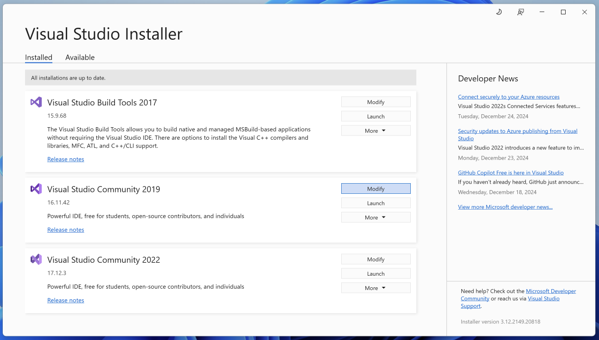
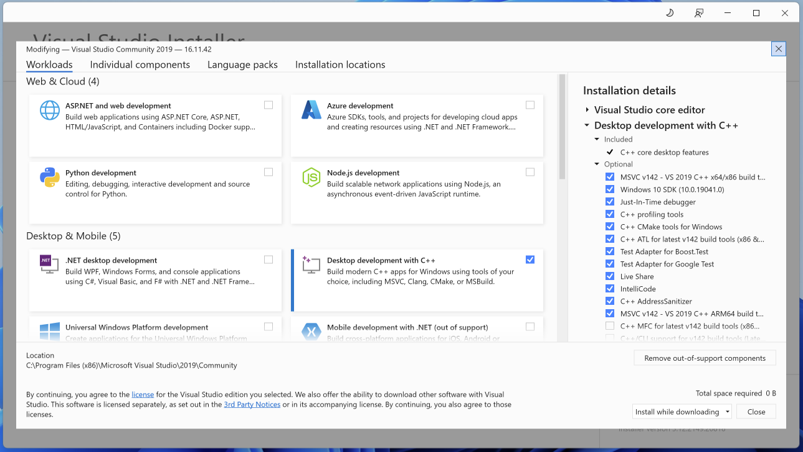

# Getting Started

Covers how to set up a build environment for contributing to FreeCAD

Working on FreeCAD is similar to working on may other open-source projects. This guide provides a short overview of the process. Much more information can be found at https://wiki.freecad.org.

## Build Environment

To work on FreeCAD you will need CMake, git, a code editor, a C++ compiler, and a Python interpreter. Many different combinations work:

- On Linux, it's common to use vim, emacs, KDevelop, or CLion as your editor. Compilation with GCC and Clang is supported.
- On Windows we support Visual Studio, Visual Studio Code, and CLion for development, all using the MSVC compiler toolchain.
- On MacOS you will need to install the XCode command line tools, and can use XCode, Visual Studio Code, or CLion as your editor.

Other combinations may work as well, these are just the ones that you will be able to get help with most readily on the [FreeCAD Forum](https://forum.freecad.org).

## Dependencies

See also [Dependencies](dependencies.md)

FreeCAD depends on many other open source projects to provide the basic foundations of the program. There are many ways of installing these dependencies: for details and the complete list, see the following Wiki pages:

- Linux: [https://wiki.freecad.org/Compile_on_Linux](https://wiki.freecad.org/Compile_on_Linux)
- Windows: [https://wiki.freecad.org/Compile_on_Windows](https://wiki.freecad.org/Compile_on_Windows)
- Mac: [https://wiki.freecad.org/Compile_on_MacOS](https://wiki.freecad.org/Compile_on_MacOS)

### Pixi

One of the easiest ways of creating a standalone FreeCAD build environment with its dependencies in a way that does not affect the rest of your system is to use
[Pixi](https://pixi.sh/latest/).

1. Install `pixi` using the following command:

- Windows (PowerShell): `iwr -useb https://pixi.sh/install.ps1 | iex`
- Linux/macOS: `curl -fsSL https://pixi.sh/install.sh | bash`

2. Configure FreeCAD for your platform.  There are additional steps necessary on Windows outlined in the next subsection.

    `pixi run configure`

3. Build FreeCAD

    `pixi run build`

    If your computer has less ram than is necessary to run a compiler per processor core, then you can reduce the number of parallel compiler jobs.  For example, if you wish to limit to 4 parallel compiler processes use the following command:

    `pixi run build -j 4`

4. Run FreeCAD

    `pixi run freecad`

In general, there will be no need to re-run the configure command as it will be automatically run by `pixi run build` if needed.  However, there may be times in which a git submodule is added or updated.  To integrate these changes, the command `pixi run initialize` will run the commands necessary.

### Pixi on Windows

Pixi uses the `conda-forge` packages, including the `compilers` metapackage to bring in the platform-specific compiler support.  On Windows, it is expected that Microsoft Visual C++ has been installed and matches the version used by the `conda-forge` team, which is [Visual Studio Community 2019](https://visualstudio.microsoft.com/vs/older-downloads/#visual-studio-2019-and-other-products).

The Visual Studio Installer may be used to install Visual Studio Community 2019 alongside newer versions of Visual Studio.  Ensure all of the necessary components are installed:

1. Open the Visual Studio Installer
2. Click `modify` for Visual Studio 2019.

    

3. Make sure to select `Desktop development with C++` under the `Desktop & Mobile` section.  Ensure that the necessary optional items are selected on the right.

    

## Setting up for Development

1. Fork [https://github.com/FreeCAD/FreeCAD](https://github.com/FreeCAD/FreeCAD) on GitHub
2. Clone your fork: for example, on the command line you can use `git clone --recurse-submodules https://github.com/YourUsername/FreeCAD FreeCAD-src`
3. Set up `pre-commit` (our automatic code-formatter and checker):

    - Install `pre-commit` (either using your system package manager or pip):
      - Debian/Ubuntu: `apt install pre-commit`
      - Fedora: `dnf install pre-commit` (Fedora)
      - Arch Linux: `pacman -S pre-commit`
      - Other (pip in PATH): `pip install pre-commit`
      - Other (pip not in PATH): `python -m pip install pre-commit`
    - On a command line, change into your FreeCAD clone, e.g. `cd FreeCAD-src`
    - Run `pre-commit install` (or `python -m pre-commit install`, depending on your PATH)

4. We **strongly** recommend doing an out-of-source build, that is, build FreeCAD and put all generated files in a separate directory. Otherwise, the build files will be spread all over the source code and it will be much harder to sort out one from the other. A build directory can be created outside the FreeCAD source folder or inside:

    - `mkdir build`
    - `cd build`

5. Run CMake, either in via the CMake GUI or on the command line see the wiki compilation page for your operating system for a detailed list of options.
6. CMake will generate project files that can be read by your IDE of choice. See your IDE's documentation for details. In general:

    - On Linux, compile with a command like `cmake --build /path/to/FreeCAD-src` run from your build directory ( or `cmake --build ..` if your build directory is inside FreeCAD-src).
    - On Windows with Visual Studio, build the "ALL_BUILD target" (you will have to change the path to the final executable the first time you try to run that target).
    - On Mac on the command line use `cmake --build /path/to/FreeCAD-src` from your build directory, or if using CLion be sure to "Build All" the first time you run.

7. If you plan on submitting a PR, create a branch:

    - `git branch fixTheThing`
    - `git checkout fixTheThing` (or both commands in one go: `git checkout -b fixTheThing`)

## Running and Debugging

   - [Visual Studio Code](gettingstarted/VSCode)
   - [CLion](gettindstarted/CLion)

## Submitting a PR

The basic process is:

1. Write some code (and possibly some unit tests)
2. `git add file1.cpp file2.cpp`
3. `git commit -m "Sketcher: Fixed bug in constraints" -m "Added foo to bar. Fixes #1234."`
    - When running `git commit` our pre-commit hooks will run to check your code. If the scripts had to make changes, you will have to `git add` the changed files and run `git commit` again.
4. `git push` to send your changes to GitHub
5. Visit https://github.com/FreeCAD/FreeCAD -- at the top of the screen you should see a yellow banner suggesting you create a Pull Request. Follow the instructions on the site to get the process started.

## PR Review Process ##

Maintainers review PRs on a rolling basis throughout the week, and also in a more concentrated review meeting on Mondays
(see the [FreeCAD Events Calendar](https://freecad.org/events.php) for the exact date and time in your timezone). When reviewing,
Maintainers strive to uphold the tenets of the [CONTRIBUTING.md](https://github.com/FreeCAD/FreeCAD/blob/main/CONTRIBUTING.md)
document. These meetings are open to the public and all developers are welcome to attend: particularly if you have a PR under review,
you may be able to accelerate that process by being present to address and questions or concerns that arise. You can also participate
in the process by reviewing PRs yourself. Although only Maintainers may merge PRs, anyone is welcome to test and provide feedback, and
Maintainers take that feedback into consideration when evaluating PRs. Any time you can contribute to the project is appreciated!

To expedite the PR review process, consider the following guidelines:
1) If your PR is still a work-in-progress, please mark it as a "Draft" so that Maintainers don't spend time reviewing something that is not yet ready to be merged.
2) If you get a question on your PR, it is unlikely to be merged until you respond to that question (particularly if the question is from a Maintainer).
3) The PR review meeting proceeds by going linearly through a list of ready-to-review PRs sorted by least-recently-updated: the goal is that no under-review PR ever sits for more than a week without action.
4) Adding automated tests (in Python or C++) can greatly expedite the review process by providing clear demonstration of how the new code works, and what problem it solves.
5) A good description in your PRs submission text helps Maintainers determine who is best suited to evaluate a PR, and prevents wasting time sorting through the code itself to figure out who should be looking at it.
6) FreeCAD's Maintainer team is currently quite small, and sometimes the Maintainer responsible for a certain part of the code is unable to attend the review meeting: this sometimes unavoidably delays the merge process through no fault of the submitter. We ask for your patience as we work to grow our team.
7) It helps the merge process if you can ensure you have a clean commit history in your PR, squashing any intermediate work and only retaining separate commits for logically separate parts of the PR (in most cases we hope that this is only a single commit).
